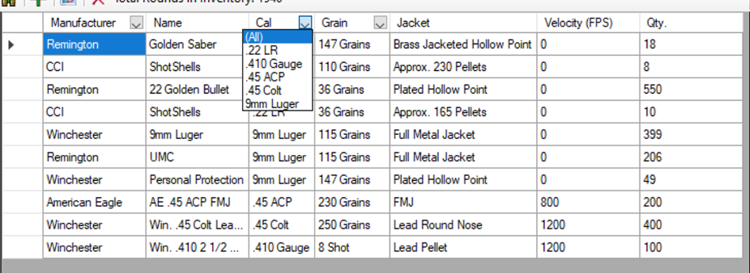
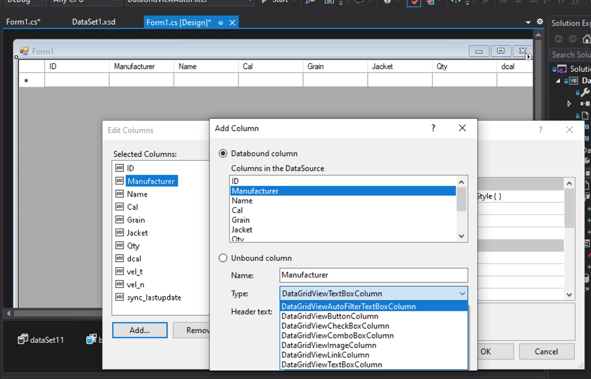
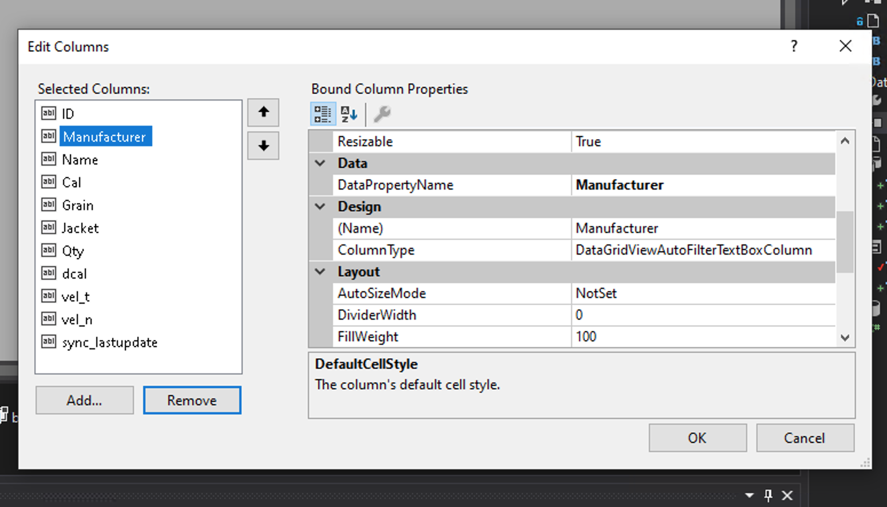
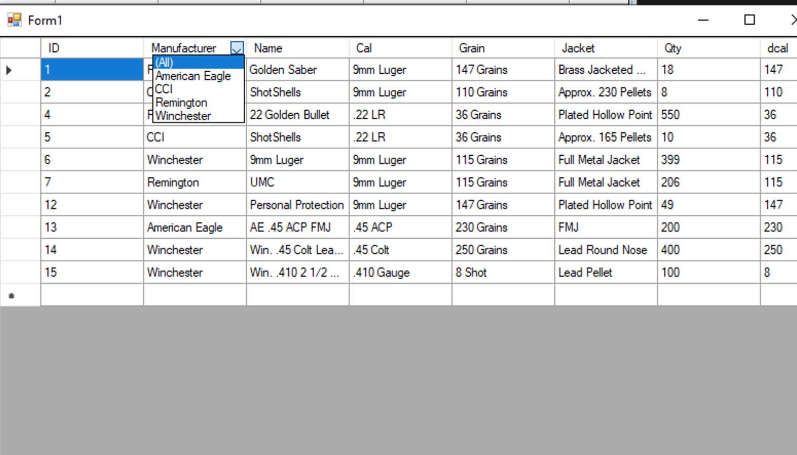

# DataGridViewAutoFilter

The DataGridViewAutoFilter project is a custom grid control that will allow you to setup fields to filter by in your winforms application.

This is mostly code less, just add the autofilter as a new bound field in your datagrid and you are good to go.

]

## Change Log

### v4.8.1.34861

* Updated to .net framework 4.8.1
* 

### v4.7.2.34861

* Using .net framework 4.7.2
* Initial Release to public on github